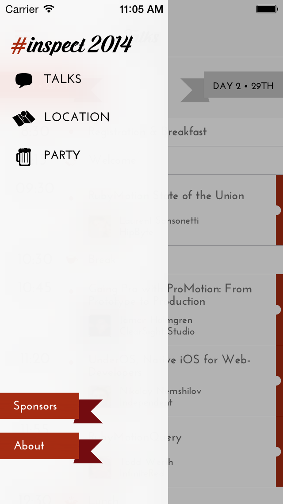
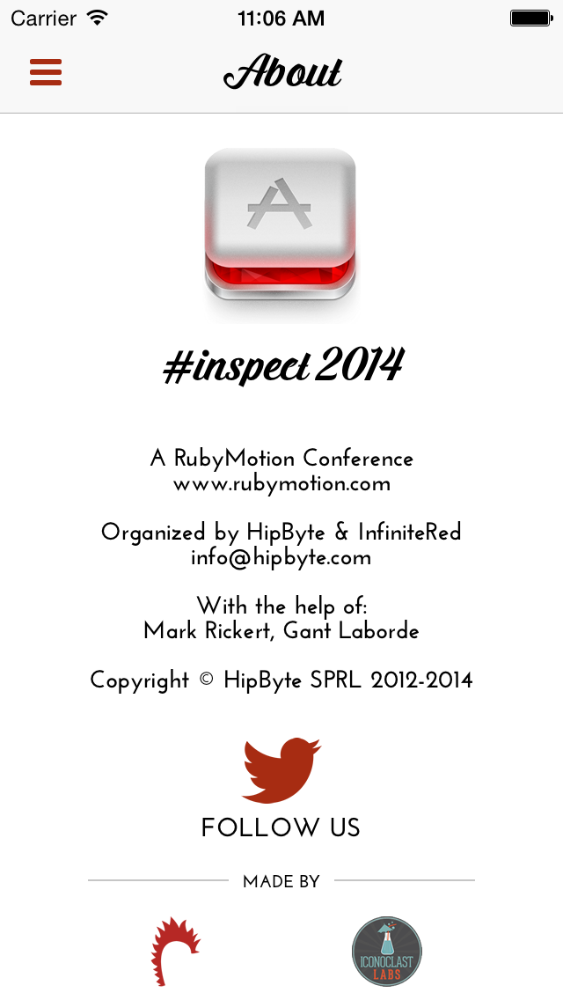
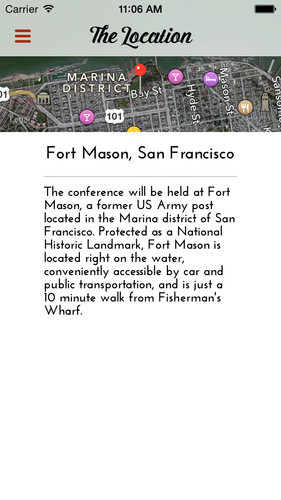

# RubyMotion Inspect 

## What is it?

*RubyMotion Inspect* is the official app for the RubyMotion Inspect annual conference.

## Getting started

You will need a license for [RubyMotion](http://rubymotion.com) and Xcode with command-line tools installed. You'll also need to setup [Cocoapods](http://cocoapods.org/) and Bundler on your machine (beyond the scope of this readme).

To run the application:

1. `bundle`
2. `rake pod:install`
3. `rake`

## Screenshots

## Authors

* [Mark Rickert](https://twitter.com/markrickert)
* [Gant Laborde](https://twitter.com/GantLaborde)

## Original Authors

This version was built upon the original #inspect2013 app, but started as a new repository and __heavily__ refactored to update to more modern RubyMotion programming techniques and for iOS 7. Authors of the original app are:

* [EPIC Agency](http://epic.net)
* [Hughes Lismonde](http://github.com/hlidotbe)
* [Laurent Sansonetti](http://github.com/lrz)

## Contributing

1. Fork it.
2. Work on a feature branch.
3. Send a pull request.

*We also like it when people who can't contribute [open an issue](https://github.com/MohawkApps/rubymotion-inspect2014/issues)*

## License

See LICENSE file.
